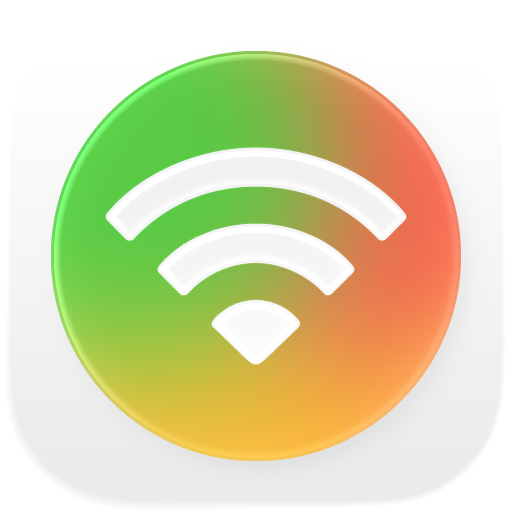
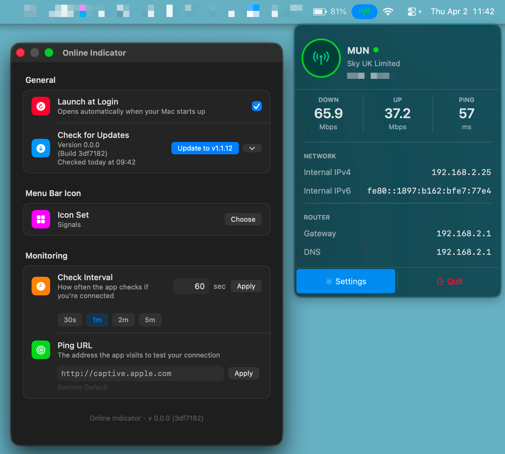

<p align="center">
  
</p>

<h1 align="center">Online Indicator</h1>

<p align="center">
A macOS menu bar app that shows real internet connectivity at a glance.
</p>
<br>
<p align="center">
  <a href="#"></a>
  <a href="https://github.com/munr/OnlineIndicator/releases" target="_blank"></a>
  <a href="https://github.com/munr/OnlineIndicator/blob/main/LICENSE" target="_blank"></a>
</p>
<br>



## Why Online Indicator?

The macOS WiFi icon only shows that you are connected to a router, not whether your internet is actually working or being blocked. Online Indicator replaces it with a live status icon that verifies real internet connectivity at the network level, so you can instantly see if you are online, offline, or blocked without opening any apps, giving you a smarter and slightly geekier way to understand your connection at a glance.

<br>

## Features

🛜 **Ditch the boring Wi-Fi icon** <br>
Your menu bar deserves better than a grey Wi-Fi symbol that tells you nothing. Online Indicator replaces it with a live status icon that actually means something:

- Green when you're online
- Yellow when something's off
- Red when there's no network

🎨 **Choose your icon set** <br>
Pick from 17 ready-made icon sets — WiFi, Status, Shield, Globe, Network, and more — applied in one tap. The active set is shown at a glance in Settings.

📋 **At-a-glance connection overview** <br>
A card-style dropdown gives you a full picture of your connection the moment you click:

- **Hero header** — your Wi-Fi network name, ISP name, and external IP address, all in one place
- **Speed & latency bar** — live download speed, upload speed, and ping
- **Network details** — your local IPv4 and IPv6 addresses, one tap to copy either
- **Router & DNS** — your default gateway (router) IP and active DNS server addresses
- **Settings & Quit** — a clean two-button footer to jump straight to preferences or exit

📶 **Wi-Fi signal ring** <br>
A colour-coded ring around the menu bar icon reflects your Wi-Fi signal strength in real time — green for strong, yellow, orange, or red as signal drops.

🔒 **VPN indicator** <br>
When a VPN is active, a styled pill badge appears next to your external IP in the menu header so you always know when you're tunnelled.

📡 **Flexible monitoring** <br>
Choose any URL to ping and set how often the check runs, from every 30 seconds to once an hour.

👀 **Quick IP peek** <br>
Your local IPv4, IPv6, and external IP are always one click away in the menu — tap to copy instantly.

<br>

## Download & Install

### 1 · Download

Head to the [**Latest Release**](../../releases/latest) page and grab the latest `.dmg` file.

### 2 · Install

Open the `.dmg` and drag **Online Indicator** into your **Applications** folder. Done.

### 3 · First Launch

#### Option A — System Settings

1. Go to **System Settings → Privacy & Security**
2. Scroll down until you see Online Indicator listed as blocked
3. Click **Open Anyway** and enter your password

#### Option B — Terminal

Paste this into Terminal and press Enter:

```bash
xattr -dr com.apple.quarantine /Applications/Online\ Indicator.app
```

Then open the app normally.

> 💡 **Why does this happen?**
> Apple requires a $99/year developer certificate to "notarise" apps. Online Indicator is free and independent, so it skips that. The warning is Apple's way of flagging uncertified apps, not a sign that anything is wrong.

<br>

## Privacy Policy

Online Indicator collects no data. Period.

- No analytics, crash reporting or usage tracking
- No personal information collected or transmitted
- All preferences are stored locally on your Mac

The only outbound network request the app makes is the connectivity probe, a simple HTTP request to `captive.apple.com` (or your custom URL) to check if the internet is reachable. This is identical to what macOS itself does internally.

<br>

## License

[MIT License](LICENSE)
